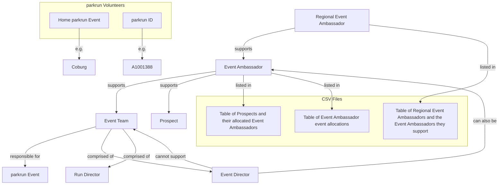

# Ambassy

## Introduction

This is a project written by a parkrun Regional Event Ambassador (REA) to save some time and effort. A Regional Event Ambassador (REA) is a parkrun volunteer who supports more than one Event Ambassador (EA). An Event Ambassador is a parkrun volunteer who supports more than one Event Team. An Event Team is responsible for the care and delivery of a single parkrun Event an a weekly basis. An event team is comprised of one or two Event Directors (ED) plus some Run Directors (RD) -- these are also parkrun volunteers.

parkrun has many _events_ around the world, which are listed at <http://images.parkrun.com/events.json>. Event Ambassadors may also support "prospects". A prospect is an event that has not yet started and is not yet listed by parkrun.

We'll keep a table of these and their allocated Event Ambassadors in a CSV file.
We'll keep a table of Event Ambassador event allocations in a separate CSV file.
A third CSV file will keep a table of Regional Event Ambassadors and the Event Ambassadors they support.
These CSV files will remain private and will be uploaded via the /upload page.

We are not concerned with all parkrun events globally, just those within the care of the Regional Event Ambassadors listed.

Some notes about parkrun volunteers. They each have a "home" parkrun Event (e.g. "Coburg") and a parkrun ID, which is an "A" followed by a number (e.g. "A1001388"). We'll keep these next to their names in the spreadsheet. An ED can also be an EA, but cannot support the Event Team of which they are a part.

## A concept map of the entities described above

## What this project will do

- Render a map, showing the locations of each of the parkrun volunteers identified and their allocations
- Make recommendations as to which EAs are best-placed to support local events and prospects
- Make recommendations as to which REAs are best-placed to support local EAs

## How it will work

This project is written in TypeScript, has unit tests, and the map will be displayed in any modern web browser.

## State Persistence and Sharing

Ambassy automatically persists your uploaded CSV data to browser local storage, so you don't need to re-upload files every time you visit the application. Your data persists across browser sessions.

### Sharing Your State

Click the **"Share…"** button to share your current map and allocations with other ambassadors. You can choose from several sharing methods:

- **Save to File**: Download a JSON file containing your state that you can send via email or file sharing
- **Copy Share Link**: Copy a link that automatically loads your state when opened (for smaller states)
- **Copy State Text**: Copy the state data as text that can be pasted into Ambassy
- **Share via Device**: Use your device's native share menu (mobile/desktop) to share via messaging apps, email, etc.

**Note**: If your state is too large for link sharing, you'll be prompted to use file or text sharing instead.

### Opening Shared State

Click the **"Open Saved State"** button to load state shared by another ambassador. You can:

- Select a shared file you received
- Paste a shared link or data URL
- Drag and drop a shared file directly onto the page

**Note**: Opening shared state will replace your current data. You'll be asked to confirm before opening if you have existing data.

### Export Reminders

If you've made changes since your last export, Ambassy will remind you to share your state before closing the browser window. This helps ensure your changes aren't lost.

## Ambassador Capacity Management

Ambassy provides tools for managing ambassador capacity and lifecycle:

### Onboarding Ambassadors

- **Add Event Ambassador**: Click "Add Event Ambassador" to add a new Event Ambassador to the system
  - You'll be prompted to enter the ambassador's name and state (e.g., "VIC", "NSW")
  - You can optionally assign the Event Ambassador to a Regional Ambassador during onboarding
- **Add Regional Ambassador**: Click "Add Regional Ambassador" to add a new Regional Ambassador to the system
  - You'll be prompted to enter the ambassador's name and state
- New ambassadors start with no assigned events/EAs and can be assigned as needed

### Allocating Events from the Map

- **Allocate Unallocated Events**: Click on an unallocated event marker on the map (small purple markers) to allocate it to an Event Ambassador
  - Unallocated events appear as small markers (radius: 1) with default purple colour
  - Clicking an unallocated event opens an allocation dialog with suggested Event Ambassadors
  - The system suggests EAs based on capacity, geographic proximity, and existing allocations
  - You can select from the top suggestions or choose "Other" to manually select any Event Ambassador
  - The supporting Regional Ambassador is automatically determined from the selected EA's hierarchy
  - After allocation, the event appears in the Event Teams table with complete information (EA, REA, Event Directors if known)
  - The map updates immediately to show the newly allocated event with the EA's assigned colour and larger size
  - All allocations are logged in the changes log

### Adding Prospects by Address

- **Add New Prospect**: Click the "📍 Add Prospect" button in the main toolbar to add a new prospective event
  - Enter the required information:
    - **Prospect Name**: The name of the prospective event
    - **Address**: Any level of detail (e.g., "123 Main St, Melbourne VIC 3000" or just "Melbourne, VIC")
    - **State/Region**: The state or region (e.g., "VIC", "NSW")
  - Optional fields include:
    - **Event Director(s)**: Name of the prospect Event Director(s)
    - **Date Made Contact**: When contact was first made (defaults to today)
    - **Course Found**: Checkbox to indicate if a course has been found
    - **Landowner Permission**: Checkbox to indicate if landowner permission has been obtained
    - **Funding Confirmed**: Checkbox to indicate if funding has been confirmed
  - The system automatically:
    - Geocodes the address to get coordinates (with 500ms debounce)
    - Infers the country from the coordinates (displays as two-letter code, e.g., "AU")
    - Generates Event Ambassador allocation suggestions based on capacity and proximity
  - If geocoding fails:
    - An error message is displayed with a "Retry Geocoding" button
    - You can manually enter coordinates in "latitude, longitude" format (e.g., "-37.8136, 144.9631")
    - The system will validate the coordinates and infer the country
  - Select an Event Ambassador:
    - Choose from the top 5 suggestions (showing allocation counts, distances, and reasons)
    - Or use the "Other" dropdown to manually select any Event Ambassador
  - Duplicate detection:
    - If a prospect with the same name, country, and state already exists, a warning is displayed
    - You can still create the prospect if needed
  - After creation:
    - The prospect appears in the Prospects table
    - The map updates to show the new prospect marker
    - The allocation is logged in the changes log

### Capacity Checking

The system automatically checks ambassador capacity against configurable limits:
- **Event Ambassadors**: Preferred range is 2-9 events (configurable)
- **Regional Ambassadors**: Preferred range is 3-10 Event Ambassadors (configurable)
- Capacity status is displayed with emoji indicators:
  - ⬇️ Under capacity (below minimum)
  - ✅ Within capacity (within preferred range)
  - ⚠️ Over capacity (above maximum)

### Transitioning Ambassadors

Ambassadors can transition between Event Ambassador and Regional Ambassador roles:

- **Event Ambassador to Regional Ambassador**: Click "⬆️ Transition to REA" next to an Event Ambassador
  - The ambassador's event assignments are preserved for later reallocation
  - The ambassador moves to the Regional Ambassadors table
  - Their events are visible in the "Events for reallocation" field
- **Regional Ambassador to Event Ambassador**: Click "⬇️ Transition to EA" next to a Regional Ambassador
  - You'll need to reallocate all supported Event Ambassadors to other Regional Ambassadors
  - The system will show reallocation suggestions for each Event Ambassador
  - The ambassador moves to the Event Ambassadors table with an empty events list

### Offboarding Ambassadors

When an ambassador leaves or changes roles:
- Click the "🚪 Offboard" button next to their name in the ambassador tables
- The system suggests reallocation recipients based on:
  - Available capacity
  - Regional alignment (same Regional Ambassador)
  - Geographic proximity
  - Conflict avoidance
- You can reallocate events/EAs to different recipients individually
- All changes are automatically logged and the UI updates immediately

### Configuring Capacity Limits

- Click "Configure Capacity Limits" to adjust preferred capacity ranges
- Limits persist across sessions and are included in exported state
- Changes immediately update all ambassador capacity statuses

## Development with Speckit

This project uses [Speckit](https://speckit.org/) (Spec Kit) for specification-driven development. Speckit helps ensure that features are well-specified before implementation, reducing errors and improving code quality.

### Getting Started with Speckit

Speckit is already installed and configured for this project. The Specify CLI tool is available via `uv`.

### Using Speckit Commands

Speckit provides several slash commands that you can use in your AI assistant (Cursor):

- `/speckit.constitution` - Establish project principles
- `/speckit.specify` - Create baseline specification for a new feature
- `/speckit.clarify` - Ask structured questions to clarify ambiguous requirements
- `/speckit.plan` - Create implementation plan from specification
- `/speckit.checklist` - Generate quality checklists
- `/speckit.tasks` - Generate actionable tasks from plan
- `/speckit.analyze` - Cross-artifact consistency & alignment report
- `/speckit.implement` - Execute implementation tasks

### Workflow

The typical Speckit workflow follows these phases:

1. **Foundation**: Establish project principles and create specifications
2. **Clarification**: Resolve ambiguities in requirements
3. **Planning**: Choose tech stack and architecture
4. **Tasks**: Break down into actionable items
5. **Implementation**: Generate working code

For more information, see the [Speckit documentation](https://speckit.org/).
