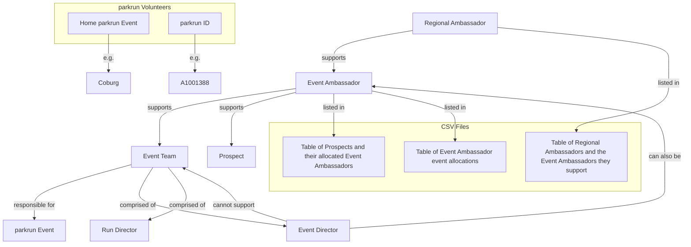

# Ambassy

## Introduction

This is a project written by a parkrun Regional Ambassador (RA) to save some time and effort. A Regional Ambassador is a parkrun volunteer who supports more than one Event Ambassador (EA). An Event Ambassador is a parkrun volunteer who supports more than one Event Team. An Event Team is responsible for the care and delivery of a single parkrun Event an a weekly basis. An event team is comprised of one or two Event Directors (ED) plus some Run Directors (RD) -- these are also parkrun volunteers.

parkrun has many _events_ around the world, which are listed at <http://images.parkrun.com/events.json>. Event Ambassadors may also support "prospects". A prospect is an event that has not yet started and is not yet listed by parkrun.

We'll keep a table of these and their allocated Event Ambassadors in a CSV file.
We'll keep a table of Event Ambassador event allocations in a separate CSV file.
A third CSV file will keep a table of Regional Ambassadors and the Event Ambassadors they support.
These CSV files will remain private and will be uploaded via the /upload page.

We are not concerned with all parkrun events globally, just those within the care of the Regional Ambassadors listed.

Some notes about parkrun volunteers. They each have a "home" parkrun Event (e.g. "Coburg") and a parkrun ID, which is an "A" followed by a number (e.g. "A1001388"). We'll keep these next to their names in the spreadsheet. An ED can also be an EA, but cannot support the Event Team of which they are a part.

## A concept map of the entities described above

## What this project will do

- Render a map, showing the locations of each of the parkrun volunteers identified and their allocations
- Make recommendations as to which EAs are best-placed to support local events and prospects
- Make recommendations as to which RAs are best-placed to support local EAs

## How it will work

This project is written in TypeScript, has unit tests, and the map will be displayed in any modern web browser.
