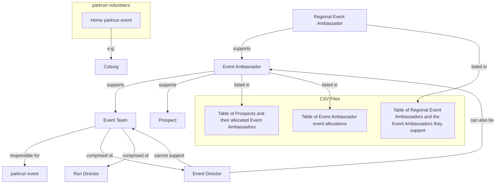

# Ambassy

## Introduction

This is a project written by a parkrun Regional Event Ambassador (REA) to save some time and effort. A Regional Event Ambassador (REA) is a parkrun volunteer who supports more than one Event Ambassador (EA). An Event Ambassador is a parkrun volunteer who supports more than one Event Team. An Event Team is responsible for the care and delivery of a single parkrun event on a weekly basis. An event team is comprised of one or two Event Directors (ED) plus some Run Directors (RD); these are also parkrun volunteers.

parkrun has many _events_ around the world, which are listed at <http://images.parkrun.com/events.json>. Event Ambassadors may also support "prospects". A prospect is an event that has not yet started and is not yet listed by parkrun.

We'll keep a table of these and their allocated Event Ambassadors in a CSV file.
We'll keep a table of Event Ambassador event allocations in a separate CSV file.
A third CSV file will keep a table of Regional Event Ambassadors and the Event Ambassadors they support.
These CSV files stay on your device until you load them in Ambassy using the file picker on the main page.

We are not concerned with all parkrun events globally, just those within the care of the Regional Event Ambassadors listed.

Some notes about parkrun volunteers. They each have a "home" parkrun event (for example "Coburg"). An ED can also be an EA, but cannot support the Event Team of which they are a part.

## A concept map of the entities described above

```mermaid
graph TD
    REA[Regional Event Ambassador] -->|supports| EA[Event Ambassador]
    EA -->|supports| ET[Event Team]
    ET -->|responsible for| PE[parkrun event]
    ET -->|comprised of| ED[Event Director]
    ET -->|comprised of| RD[Run Director]
    EA -->|supports| P[Prospect]

    subgraph CSV Files
        CSV1[Table of Prospects and their allocated Event Ambassadors]
        CSV2[Table of Event Ambassador event allocations]
        CSV3[Table of Regional Event Ambassadors and the Event Ambassadors they support]
    end

    REA -->|listed in| CSV3
    EA -->|listed in| CSV1
    EA -->|listed in| CSV2

    subgraph vol[parkrun volunteers]
        PV1[Home parkrun event]
    end

    PV1 -->|e.g.| Coburg
    ED -->|can also be| EA
    ED -->|cannot support| ET
```

## User Interface

Ambassy features a clean, professional interface with:

- **Header**: Displays app branding, breadcrumb navigation, and all primary action buttons
  - Skip link (“Skip to main content”) for keyboard users; breadcrumb trail: johnsy.com → parkrun utilities → Ambassy
  - All action buttons are consolidated in the header for easy access
  - Buttons that require loaded data (Add EA, Add REA, Add Prospect, Configure, Purge) are automatically hidden when no data is loaded
  - Import and Keyboard Shortcuts buttons remain visible at all times
  - Export button appears when data is loaded and map view is visible
  - All buttons have consistent height and styling
- **Footer**: Single paragraph with version (changelog link), author, GitHub, and license
- **Responsive Design**: Adapts seamlessly to desktop, tablet, and mobile devices
  - Header buttons wrap appropriately on smaller screens
  - File input buttons match the styling of other buttons
- **parkrun colour palette**: Header and footer use the same palette as sibling microsites (eventuate, foretoken, pr-by-pt): aubergine background, apricot links, Atkinson Hyperlegible

## What Ambassy does

- Renders a map showing the locations of parkrun volunteers you have loaded and their allocations
- Suggests which EAs are well placed to support local events and prospects
- Suggests which REAs are well placed to support local EAs

## How it is built

The app is written in TypeScript with unit tests and runs in a modern web browser. A production build updates `sitemap.xml`’s `<lastmod>` to the build date so search engines see an accurate last-modified time.

## Releases and versioning

Merges to `main` use [semantic-release](https://semantic-release.gitbook.io/) with [Conventional Commits](https://www.conventionalcommits.org/). Commit messages must follow the convention (`feat:`, `fix:`, `perf:`, etc.); commitlint runs locally (husky) and in CI.

On each code release, CI generates `CHANGELOG.md`, bumps `package.json`, tags `vX.Y.Z`, publishes a GitHub Release, rebuilds with the new version injected into the footer, and deploys to GitHub Pages. The footer version links to that tag’s changelog. Docs-only changes (`docs/`, `specs/`, `CONTEXT.md`, `README.md`, `.github/`) skip versioning but still redeploy Pages.

See [ADR 0008](docs/adr/0008-semantic-release-and-changelog.md) for the full release and deploy flow.

## Local development

- Install dependencies: `pnpm install`
- Run the development server: `pnpm start`
- Run tests: `pnpm test`
- Lint: `pnpm run lint`
- Production build (writes to `dist/`): `pnpm run build`

The development server enables webpack filesystem caching and uses `eval-cheap-module-source-map` for faster rebuilds. Stack traces map to TypeScript modules; line numbers may be approximate. For line-accurate source maps while debugging, run `pnpm run start:sourcemaps`.

After `pnpm run build`, run `pnpm run smoke:map-dom-budget` to check map overlay and DOM budgets against the bundled sample CSVs (also runs in CI).

### Voronoi performance timings (development)

When running `pnpm start`, a global Voronoi recompute (after allocations or catalogue changes, not on pan/zoom) records a `performance.measure` named `ambassy:voronoi-compute` and logs a `console.debug` line with duration, site count, and visible territory count.

To inspect timings in browser devtools:

1. Open the **Performance** panel (or **Performance insights** in Chromium).
2. Reload with CSVs loaded, or trigger a change that invalidates Voronoi sites (for example allocate an event).
3. Look for the user timing **`ambassy:voronoi-compute`**, or filter the console to **Verbose** to see the debug line.

Pan and zoom only re-clip cached rings; they do not emit this measure.

## Privacy and data sovereignty

Uploaded CSV data are processed in the browser and persisted in local storage on your device. Optional **parkrunner IDs** and imported **visit histories** are stored the same way. Nothing is uploaded to johnsy.com or stored on application servers. Only the columns Ambassy understands are read from each CSV; any other columns are ignored and never stored. There is no analytics whatsoever: usage is not counted, adoption is not measured, and Ambassy is shared in goodwill, not to boost traffic or prove how many people use it. The intent is close to [Datensparsamkeit](https://martinfowler.com/bliki/Datensparsamkeit.html) (data minimisation): carry only what you need for the job.

Outbound requests are limited to OpenStreetMap map tiles, the public parkrun events catalogue, and — if you install the finish export userscript — fetching that script from johnsy.com for installation and updates. That script request does not include your allocation or finish data. Visiting parkrun profile pages to import finishes is ordinary browsing on parkrun's own sites. When you geocode a place, the search text you enter is sent to OpenStreetMap’s [Nominatim](https://nominatim.org/release-docs/latest/), and that request does not include your CSV or ambassador names.

Sharing state only happens when you explicitly export or import a file. Exported state includes allocations, ambassadors, prospective events, visit histories, and related settings (including parkrunner IDs when set). The parkrun events catalogue cache is not included — Ambassy re-fetches it. Finish import may copy JSON to your clipboard if you use that fallback, or pass through [Tampermonkey](https://www.tampermonkey.net/) on your device when moving from a parkrun profile tab to Ambassy. You may use aliases in CSVs; using real names can make conflicts of interest across volunteer tiers easier to see.

## State persistence, export, and import

Ambassy automatically persists your uploaded CSV data, parkrunner IDs, prospective events, and imported visit histories to browser local storage, so you do not need to re-upload files every time you visit the application. Your data persist across browser sessions.

### Export

Click **Export** to immediately download a JSON file (`ambassy-state-YYYY-MM-DD.json`) containing all Ambassy data on this device that cannot be recovered from parkrun alone. Pass the file to colleagues by your usual file-transfer or messaging tools.

### Import

Click **Import** to load an export file from another ambassador, or drag and drop a `.json` file onto the page. Import replaces all persisted Ambassy data in the export scope on this device. You will be asked to confirm if you already have local data or unsaved changes.

Legacy `1.0.0` export files (without prospective events or visit histories) are still accepted; missing fields default to empty.

### Export reminders

If you've made changes since your last export, Ambassy will remind you to export your state before closing the browser window. This helps ensure your changes aren't lost.

## Ambassador visit history

Ambassy can show **last ambassador visit** on the Event Teams tab (who finished at that event most recently, and when), based on imported parkrun profile visit history.

### Setup

1. Open **Visit history** from the top bar and follow the instructions to add the finish export userscript to Tampermonkey. Tampermonkey checks the published script on [www.johnsy.com](https://www.johnsy.com/ambassy/script/ambassy-finish-export.user.js) for updates automatically.
2. Set each ambassador's **parkrunner ID** (e.g. `A1001388`) on the Event Ambassadors or Regional Ambassadors tab, or via the optional `parkrunner ID` CSV column.

### Importing finishes

1. Open the ambassador's parkrun profile `/all/` page (link from their parkrunner ID when set).
2. Click **Export finishes to Ambassy** on that page.
3. Open or switch to Ambassy — the import runs automatically when the userscript bridge delivers the payload (no refresh needed if Ambassy is already open).
4. If the parkrunner ID is not yet assigned, confirm the suggested ambassador in the assign dialog. If you cancel, use **Resume** on the main-page banner or **Import visit history from clipboard** on the Visit history page.

**Clipboard fallback:** copy the JSON from the userscript notification, then click **Import visit history from clipboard** on the Visit history page (this also resumes a pending import when one is waiting).

Only finishes that match live events in `events.json` are kept. Re-import merges history, keeping the latest finish date per event per ambassador.

### Privacy

Visit history is imported only when you choose to. It is stored in local storage on your device and is not uploaded to johnsy.com. The userscript may use Tampermonkey to hand off data between tabs on your device; clipboard import is available if you prefer. See [Privacy and data sovereignty](#privacy-and-data-sovereignty) for the full picture.

## Ambassador Capacity Management

Ambassy provides tools for managing ambassador capacity and lifecycle:

### Onboarding Ambassadors

- **Add Event Ambassador**: Click "Add Event Ambassador" to add a new Event Ambassador to the system
  - You'll be prompted to enter the ambassador's name and state (e.g., "VIC", "NSW")
  - You can optionally assign the Event Ambassador to a Regional Ambassador during onboarding
- **Add Regional Ambassador**: Click "Add Regional Ambassador" to add a new Regional Ambassador to the system
  - You'll be prompted to enter the ambassador's name and state
- New ambassadors start with no assigned events/EAs and can be assigned as needed

### Allocating Events from the Map

- **Allocate unallocated events**: Pan the map to the area you care about, then click a small purple **unallocated** marker to allocate that live parkrun to an Event Ambassador. Only parkruns in the current map viewport (plus a small buffer) are shown — not the full global catalogue. **Event search** (keyboard shortcut) remains available for events outside the current view. Clear the **Ambassador name filter** if it is active — a filter hides unallocated markers on the map.
- **Allocated events**: Click an allocated event marker to reallocate or inspect it. After allocation, the event appears in the Event Teams table with complete information (EA, REA, Event Directors if known), the map updates with the EA's colour, and the change is logged.

### Adding Prospects by Address

- **Add New Prospect**: Click the "📍 Add Prospect" button in the main toolbar to add a new prospective event
  - Enter the required information:
    - **Prospect Name**: The name of the prospective event
    - **Address**: Any level of detail (e.g., "123 Main St, Melbourne VIC 3000" or just "Melbourne, VIC")
    - **State/Region**: The state or region (e.g., "VIC", "NSW")
  - Optional fields include:
    - **Event Director(s)**: Name of the prospect Event Director(s)
    - **Date Made Contact**: When contact was first made (defaults to today)
    - **Course Found**: Checkbox to indicate if a course has been found
    - **Landowner Permission**: Checkbox to indicate if landowner permission has been obtained
    - **Funding Confirmed**: Checkbox to indicate if funding has been confirmed
  - The system automatically:
    - Geocodes the address to get coordinates (with 500ms debounce)
    - Infers the country from the coordinates (displays as two-letter code, e.g., "AU")
    - Generates Event Ambassador allocation suggestions based on capacity and proximity
  - If geocoding fails:
    - An error message is displayed with a "Retry Geocoding" button
    - You can manually enter coordinates in "latitude, longitude" format (e.g., "-37.8136, 144.9631")
    - The system will validate the coordinates and infer the country
  - Select an Event Ambassador:
    - Choose from the top 5 suggestions (showing allocation counts, distances, and reasons)
    - Or use the "Other" dropdown to manually select any Event Ambassador
  - Duplicate detection:
    - If a prospect with the same name, country, and state already exists, a warning is displayed
    - You can still create the prospect if needed
  - After creation:
    - The prospect appears in the Prospects table
    - The map updates to show the new prospect marker
    - The allocation is logged in the changes log

### Completing Prospect Lifecycle

- **Launch Prospect**: When a prospect transitions to a live parkrun event, click the "🚀 Launch" button in the Prospects table
  - Confirm the launch action (this cannot be undone)
  - The prospect is removed from the Prospects table
  - If the prospect had an assigned Event Ambassador, their allocation count is updated
  - The launch is logged in the changes log with type "Prospect Launched"
  - The map updates to remove the prospect marker
  - **Note**: Event matching and allocation during launch is planned for a future release

- **Archive Prospect**: When a prospect is not viable (no suitable course, no landowner support, no volunteer support), click the "📦 Archive" button in the Prospects table
  - Confirm the archive action (this cannot be undone)
  - The prospect is removed from the Prospects table
  - If the prospect had an assigned Event Ambassador, their allocation count is updated
  - The archive is logged in the changes log with type "Prospect Archived" and reason "not viable"
  - The map updates to remove the prospect marker

- **Keyboard Accessibility**: Both Launch and Archive buttons are fully keyboard accessible
  - Use Tab/Shift+Tab to navigate to the buttons
  - Press Enter or Space to activate the button
  - All buttons have descriptive ARIA labels for screen readers

### Capacity Checking

The system automatically checks ambassador capacity against configurable limits:

- **Event Ambassadors**: Preferred range is 2-9 events (configurable)
- **Regional Ambassadors**: Preferred range is 3-10 Event Ambassadors (configurable)
- Capacity status is displayed with emoji indicators:
  - ⬇️ Under capacity (below minimum)
  - ✅ Within capacity (within preferred range)
  - ⚠️ Over capacity (above maximum)

### Transitioning Ambassadors

Ambassadors can transition between Event Ambassador and Regional Ambassador roles:

- **Event Ambassador to Regional Ambassador**: Click "⬆️ Transition to REA" next to an Event Ambassador
  - The ambassador's event assignments are preserved for later reallocation
  - The ambassador moves to the Regional Ambassadors table
  - Their events are visible in the "Events for reallocation" field
- **Regional Ambassador to Event Ambassador**: Click "⬇️ Transition to EA" next to a Regional Ambassador
  - You'll need to reallocate all supported Event Ambassadors to other Regional Ambassadors
  - The system will show reallocation suggestions for each Event Ambassador
  - The ambassador moves to the Event Ambassadors table with an empty events list

### Offboarding Ambassadors

When an ambassador leaves or changes roles:

- Click the "🚪 Offboard" button next to their name in the ambassador tables
- The system suggests reallocation recipients based on:
  - Available capacity
  - Regional alignment (same Regional Ambassador)
  - Geographic proximity
  - Conflict avoidance
- You can reallocate events/EAs to different recipients individually
- All changes are automatically logged and the UI updates immediately

### Configuring Capacity Limits

- Click "Configure Capacity Limits" to adjust preferred capacity ranges
- Limits persist across sessions and are included in exported state
- Changes immediately update all ambassador capacity statuses

## Development with Speckit

This project uses [Speckit](https://speckit.org/) (Spec Kit) for specification-driven development. Speckit helps ensure that features are well-specified before implementation, reducing errors and improving code quality.

### Getting Started with Speckit

Speckit is already installed and configured for this project. The Specify CLI tool is available via `uv`.

### Using Speckit Commands

Speckit provides several slash commands that you can use in your AI assistant (Cursor):

- `/speckit.constitution` - Establish project principles
- `/speckit.specify` - Create baseline specification for a new feature
- `/speckit.clarify` - Ask structured questions to clarify ambiguous requirements
- `/speckit.plan` - Create implementation plan from specification
- `/speckit.checklist` - Generate quality checklists
- `/speckit.tasks` - Generate actionable tasks from plan
- `/speckit.analyze` - Cross-artifact consistency & alignment report
- `/speckit.implement` - Execute implementation tasks

### Workflow

The typical Speckit workflow follows these phases:

1. **Foundation**: Establish project principles and create specifications
2. **Clarification**: Resolve ambiguities in requirements
3. **Planning**: Choose tech stack and architecture
4. **Tasks**: Break down into actionable items
5. **Implementation**: Generate working code

For more information, see the [Speckit documentation](https://speckit.org/).
